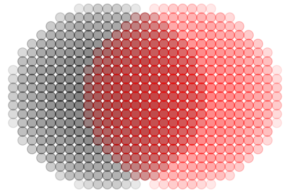
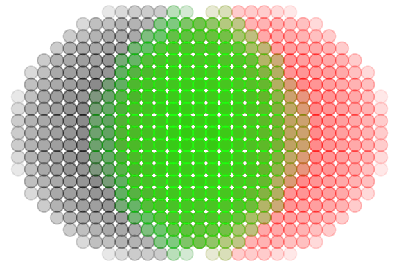

# How to use the \`coi\` library

## Background

The `coi` package is a small tool to calculate some metrics from
terrestrial laser scanning (TLS) point clouds. The name `coi` stands for
“crown overlap index” and is one of the metrics that can be extracted
with the package. The COI is calculated as described in Täuber et
al. (in prep.)

It was inspired by an earlier index called crown complementarity index
(CCI), which was presented by [Williams et
al. (2017)](https://doi.org/10.1038/s41559-016-0063). The CCI can also
be calculated by the `coi` package.

Finally the package can also extract the box dimension, a structural
complexity metric as described in [Seidel
(2018)](https://doi.org/10.1002/ece3.3661).

## COI calculation

There are two ways to calculate COI with this package. One is meant to
be used in exploratory analysis and shown directly below. If you are
sure which parameters you want to use there’s a all-in-one function at
the end of this chapter.

### Exploratory COI calculation using `compute_coi()`

First we attach the library and generate two artificial point clouds of
spheres with a radius of `1 m` a voxel resolution of `0.01 m` and
centers with a `0.5 m` distance on the x-axis.

``` r

library(coi)
library(ggplot2)

sphere1 <- gen_sphere(
  r = 0.5,
  res = 0.01,
  center = c(-0.2, 0, 0)
)
sphere2 <- gen_sphere(
  r = 0.5,
  res = 0.01,
  center = c(0.2, 0, 0)
)
```

Next, we voxelize the point clouds to a common resolution. Our
artificial spheres already have a voxel resolution. But if you work with
real-world TLS data the resolution will be variable across the point
cloud. For the algorithms to produce meaningful data we need a voxelised
cloud.

We can now take a look at our two voxelised spheres.

``` r

sphere1_v <- voxelize(
  cloud = sphere1,
  res = 0.05
)
sphere2_v <- voxelize(
  cloud = sphere2,
  res = 0.05
)

spheres <- ggplot() +
  theme_void() +
  geom_point(
    data = sphere1_v,
    aes(x, y),
    size = 3,
    color = "black",
    alpha = 0.03
  ) +
  geom_point(
    data = sphere2_v,
    aes(x, y),
    size = 3,
    color = "red",
    alpha = 0.03
  )
spheres
```



Now we will extract the interaction point cloud of our spheres using the
`extract_interaction` function. For this we will need to define `d_max`.
Here we choose `0.1 m`. Then we can add the interaction cloud to our
plot.

The `returns = "cloud"` argument ensures that the value of the function
is a point cloud which we can use for plotting.

``` r

d_max <- 0.1

interaction_cloud <- extract_interaction(
  cloud_i = sphere1_v,
  cloud_j = sphere2_v,
  d_max = d_max,
  returns = "cloud"
)

spheres +
  geom_point(
    data = interaction_cloud,
    aes(x, y),
    size = 3,
    color = "green",
    alpha = 0.03
  )
```



With this interaction cloud, the chosen d_max and the total size of both
interacting clouds, we can now calculate the COI using the `compute_coi`
function.

However for `compute_coi` we don’t need the entire interaction cloud,
just a 1-D vector of the individual points’ distances. For this we
re-run `extract_interaction` with `returns = "distances"`.

``` r

interaction_distances <- extract_interaction(
  cloud_i = sphere1_v,
  cloud_j = sphere2_v,
  d_max = d_max,
  returns = "distances"
)

total_size <- nrow(sphere1_v) + nrow(sphere2_v)

compute_coi(
  distances = interaction_distances,
  size_weight = total_size,
  d_max = d_max
)
#> [1] 0.5470105
```

### All-in-one COI calculation using `coi()`

The entire process above is very useful if you first want to test out
different values for `vox_res` and `d_max`, and inspect the interaction
clouds before running the whole pipeline on your data. However once you
found suitable values you can skip all this and use the simple `coi`
function to do all this in one step.

``` r

coi(
  cloud_i = sphere1,
  cloud_j = sphere2,
  d_max = d_max,
  vox_res = 0.05
)
#> [1] 0.5470105
```

## CCI calculation

For the CCI we again investigate how two point clouds interact. We will
need our two spheres again. We will create two pairs of spheres a and b
to demonstrate how the cci reacts to volume differences between the
interacting clouds. In a both spheres will have a radius of `2 m`. In b
one will have a r of `2 m` and the other `3 m`.

``` r

sphere1_a <- gen_sphere(
  r = 2,
  res = 0.05,
  center = c(0, 0, 0)
)
sphere2_a <- gen_sphere(
  r = 2,
  res = 0.05,
  center = c(0, 0, 0)
)

sphere1_b <- gen_sphere(
  r = 2,
  res = 0.05,
  center = c(0, 0, 0)
)
sphere2_b <- gen_sphere(
  r = 3,
  res = 0.05,
  center = c(0, 0, 0)
)
```

For CCI there is currently only exists the all-in-one function `cci`,
which makes the calculation super easy. We just need the size of the
vertical strata and the type of hull for each layer. Usually `concave`
hulls are more exact in natural contexts (though they sometimes have
problems). But since we look at spheres here `convex` hulls are totally
fine. In the resulting values we will see that a has a `cci = 0` because
the two clouds are exactly homogenous in each vertical layer, while b
has a much higher cci.

``` r

cci(
  cloud_i = sphere1_a,
  cloud_j = sphere2_a,
  strata_size = 0.2,
  hull_type = "convex",
  vox_res = 0.1
)
#> [1] 0
cci(
  cloud_i = sphere1_b,
  cloud_j = sphere2_b,
  strata_size = 0.2,
  hull_type = "convex",
  vox_res = 0.1
)
#> [1] 0.5449223
```

## Box dimension calculation

Finally we can extract the box dimension as described in [Seidel
(2018)](https://doi.org/10.1002/ece3.3661). Once again we will use two
spheres with differing sizes. However, for simple geometric shapes like
a sphere the Box dimension will always produce higher values for larger
shapes with more points. The real magic of the parameter only shines in
natural and fractal shapes like trees.

``` r

sphere_a <- gen_sphere(
  r = 0.5,
  res = 0.05
)
sphere_b <- gen_sphere(
  r = 1,
  res = 0.05
)

threshold <- 0.1

boxdim(
  cloud = sphere_a,
  threshold = threshold,
  vox_res = NULL,
  warnings = FALSE
)
#> [1] 2.27
boxdim(
  cloud = sphere_b,
  threshold = threshold,
  vox_res = NULL,
  warnings = FALSE
)
#> [1] 2.37
```
